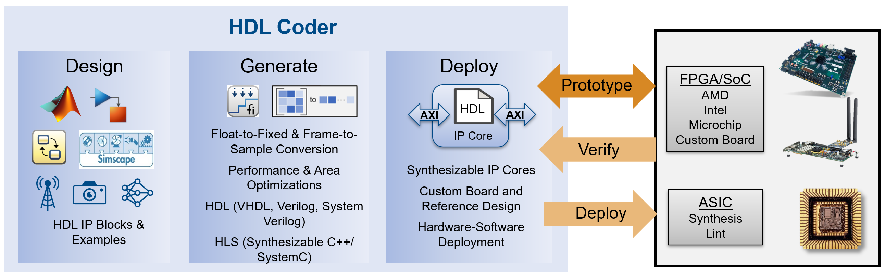

# HDL Coder
HDL Coder Examples 

Modeling Languages: MATLAB, Simulink, Stateflow, Simscape, Deep Learning

Targets: AMD/Xilinx, Intel/Altera, Microchip/Microsemi

**Related Links:**

* [HDL Coder Product Page](https://www.mathworks.com/products/hdl-coder.html)
* [HDL Coder Self Guided Tutorials (Simulink to HDL)](https://github.com/mathworks/HDL-Coder-Self-Guided-Tutorial)
* [HDL Coder Self Guided Tutorials (MATLAB to HDL)](https://www.mathworks.com/matlabcentral/fileexchange/50098-hdlcoder-design-patterns-and-examples)

